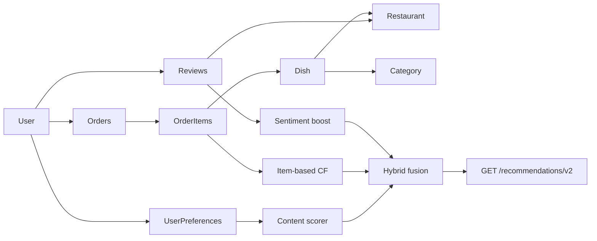

# Recommendation Engine V2 — Architecture Plan

**Status:** Planning only (no production code in this document)  
**Date:** 2026-06-02  
**Baseline:** Recommendation Engine V1.1 (`GET /recommendations`, rule-based, max 100 points)  
**Constraint:** **Do not modify** existing `GET /recommendations` or V1.1 response contracts.

---

## 1. Executive summary

Popal Eats today runs a **transparent rule-based recommender (V1.1)** driven almost entirely by **explicit user preferences** and **static dish/restaurant attributes**. The platform also collects **richer behavioral and NLP signals** (orders, cart, reviews, sentiment) that V1.1 does **not** use.

**V2 should introduce a hybrid engine** on **new API surfaces** (`/recommendations/v2`, optional sub-routes) that:

1. **Preserves V1.1** for backward compatibility and simple clients.
2. Adds **content-based scoring** with structured feature vectors (not only substring rules).
3. Adds **collaborative filtering** from **order_items** (dish-level implicit feedback).
4. **Fuses** both with review sentiment and popularity as secondary features.
5. Improves **cold-start** and **explainability** beyond fixed 40/25/20/15 weights.

**Recommended primary approach for the current database:** **Hybrid (content + item-based collaborative filtering)**, with content dominant for new users and CF gaining weight as order volume grows.

---

## 2. Current backend context

### 2.1 API surface (recommendations)

| Endpoint | Engine | Notes |
|----------|--------|-------|
| `GET /recommendations` | V1.1 | JWT; returns `items`, `score_breakdown`, `explanation`, `engine_version: "1.1"` |
| `GET /users/preferences` | — | Input profile for V1.1 |
| `PUT /users/preferences` | — | Updates taste/budget/nutrition |

**V2 rule:** Add new routes; leave `GET /recommendations` implementation and schema frozen.

### 2.2 V1.1 scoring recap (baseline behavior)

| Component | Max | Source |
|-----------|-----|--------|
| Cuisine | 40 | `favorite_cuisines` vs dish/restaurant text, category name, tags (when present) |
| Nutrition | 25 | `nutrition_goal` vs `protein`, `carbs`, `calories` |
| Budget | 20 | `budget_min` / `budget_max` vs `dish.price` |
| Rating | 15 | `restaurant.average_rating` |

Filters: `dish.is_available`, `restaurant.is_open`.  
Output: top **10** dishes, Pydantic `ScoreBreakdown` + textual explanation.

**Known limitations (documented in V1 audits):**

- Sparse explicit feedback (one review per user per restaurant; no dish-level stars).
- Macro fields often empty on dishes → nutrition component usually 0.
- Cuisine matching depends on tags/text alignment with preferences.
- `dietary_preference` stored but **not scored** in V1.1.
- No use of orders, cart, or review NLP in ranking.

---

## 3. Model analysis

### 3.1 User (`users`)

| Field | Type | Recommendation relevance |
|-------|------|---------------------------|
| `id` | PK | User key for CF matrices |
| `full_name` | string | Low |
| `email` | string | Identity only |
| `role` | string | Filter (recommend to `customer` / reviewers) |
| `profile_image` | string | Low |
| `created_at` | timestamptz | Tenure, cold-start cohort |

**Relationships:** `restaurants` (owner), `reviews`, `cart`, `orders`.

**Gaps for V2:** No inline taste vector, geo coordinates, or `last_active_at`.

---

### 3.2 UserPreferences (`user_preferences`) — 1:1 with User

*Designed in migration `004_user_preferences`; service: `user_preference_service`.*

| Field | Type | V1.1 use | V2 use |
|-------|------|----------|--------|
| `user_id` | FK, unique | Yes | Yes |
| `favorite_cuisines` | JSON array | Cuisine rules | Content features |
| `dietary_preference` | string(64) | **Unused** | Content filters (halal, vegan, …) |
| `nutrition_goal` | string(64) | Macro rules | Content + constraints |
| `budget_min`, `budget_max` | numeric | Budget rules | Hard/soft constraints |
| `created_at`, `updated_at` | timestamptz | No | Staleness decay |

**Primary explicit profile for content-based and hybrid fusion.**

---

### 3.3 Restaurant (`restaurants`)

| Field | Type | Signal |
|-------|------|--------|
| `id` | PK | CF item group (restaurant-level) |
| `name`, `description` | text | Content / cuisine |
| `city`, `address` | text | Geo proxy (weak) |
| `is_open` | bool | Eligibility filter |
| `average_rating`, `total_reviews` | float, int | Popularity trust |
| `opening_time`, `closing_time` | time | Time-aware (V2+) |
| `tags` | JSON | Cuisine/dietary (*migration `005_tags` when deployed*) |

**Relationships:** `dishes`, `reviews`, `orders`, `menu_uploads`.

---

### 3.4 Dish (`dishes`)

| Field | Type | Signal |
|-------|------|--------|
| `id` | PK | **CF item ID** (best grain for orders) |
| `restaurant_id`, `category_id` | FK | Content structure |
| `name`, `description` | text | Content / embeddings |
| `price` | numeric | Budget, value |
| `calories`, `protein`, `carbs`, `fats` | numeric | Nutrition content |
| `is_available` | bool | Eligibility |
| `tags` | JSON | Cuisine/dietary (*`005_tags`*) |
| `image` | string | Future visual features |

**Gap:** No dish-level `average_rating` or `order_count` denormalized fields.

---

### 3.5 Category (`categories`)

| Field | Signal |
|-------|--------|
| `name`, `description` | Taxonomy for content-based matching |

---

### 3.6 Order (`orders`)

| Field | Type | Signal |
|-------|------|--------|
| `user_id` | FK | CF user dimension |
| `restaurant_id` | FK | Restaurant affinity |
| `total_price` | numeric | Spend tier |
| `status`, `payment_status` | string | Weight completed orders higher |
| `delivery_address` | string | Geo (unparsed) |
| `created_at` | timestamptz | Recency, sequences |

**Relationships:** `items` → `OrderItem`.

**Note:** Orders exist in ORM; ensure Alembic migration parity on all environments (historically some DBs lacked `orders`/`carts` until manually created).

---

### 3.7 OrderItem (`order_items`)

| Field | Signal |
|-------|--------|
| `dish_id` | **Strongest implicit preference** |
| `quantity` | Interaction strength |
| `price` | Historical value at purchase |
| `created_at` | Recency |

**Enables item-based collaborative filtering:** “users who ordered X also ordered Y.”

---

### 3.8 Review (`reviews`)

| Field | Signal |
|-------|--------|
| `user_id`, `restaurant_id` | Explicit 1–5 stars (**restaurant-level only**) |
| `rating` | CF at restaurant grain (sparse: unique per user-restaurant) |
| `comment` | NLP input |
| `sentiment`, `sentiment_score` | Hybrid feature (post-AI pipeline) |
| `translated_text`, `detected_language` | Normalized text |
| `processing_status` | Quality gate |

**Constraint:** `UNIQUE(user_id, restaurant_id)` limits explicit matrix density.

---

### 3.9 Auxiliary signals (not in V1.1)

| Source | Table | Signal type |
|--------|-------|-------------|
| Cart | `carts`, `cart_items` | Short-term intent (pre-purchase) |
| Menu OCR | `menu_uploads` | Bulk dish attributes (`extracted_json`) |
| Refresh tokens | `refresh_tokens` | None |

---

## 4. Recommendation signal inventory

### 4.1 Signal matrix

| Signal | Type | Grain | Density today | V1.1 | V2 target |
|--------|------|-------|---------------|------|-----------|
| `favorite_cuisines` | Explicit | User | Medium if set | Yes | Yes (features) |
| `nutrition_goal`, macros | Explicit / content | Dish | Low (sparse macros) | Partial | Yes |
| `budget_min/max` | Constraint | Dish price | Medium | Yes | Yes (hard filter) |
| `dietary_preference` | Explicit | User | Medium | No | Yes |
| `dishes.tags`, `restaurants.tags` | Content | Dish/Restaurant | Low unless curated | Partial | Yes |
| `category.name` | Content | Dish | High | Partial | Yes |
| `order_items` | Implicit | Dish | Grows with usage | No | **Yes (CF core)** |
| `cart_items` | Implicit | Dish | Session | No | Yes (boost) |
| `reviews.rating` | Explicit | Restaurant | Sparse | Indirect (avg_rating) | Yes (restaurant CF) |
| `reviews.sentiment` | Derived NLP | Restaurant | Medium after AI | No | Yes (hybrid) |
| `restaurant.average_rating` | Aggregate | Restaurant | Medium | Yes | Yes (popularity) |
| Search/filter params | — | — | Not stored | No | Optional (events table) |

### 4.2 Interaction graph (conceptual)



---

## 5. Approach proposals

### 5.1 Content-based filtering (CB)

**Idea:** Represent user profile and dishes as feature vectors; score by similarity + constraint satisfaction.

**Features available without new tables:**

- User: cuisines, dietary preference, nutrition goal, budget band.
- Dish: category, tags, macros, price, name/description tokens.
- Restaurant: city, tags, `average_rating`, `is_open`.

**V2 enhancements over V1.1:**

| Technique | Description |
|-----------|-------------|
| Weighted feature vector | Numeric encoding of cuisines (multi-hot), goal, price band |
| Similarity function | Cosine or weighted Jaccard on tags + category |
| Constraint layer | Hard filter: halal, budget, availability; soft: nutrition |
| Optional embeddings | `sentence-transformers` on `name + description` (phase 3) |

**Strengths:** Works for **cold-start users** with preferences; explainable (“matches 3/4 cuisine tags”).  
**Weaknesses:** Depends on **data quality** (tags, macros); no “people like you” signal.

---

### 5.2 Collaborative filtering (CF)

**Idea:** Recommend dishes based on co-occurrence patterns across users.

**Best fit for this schema:**

| Variant | Matrix | Feasibility |
|---------|--------|-------------|
| **Item-based CF** | Dish × Dish from `order_items` | **High** — primary V2 CF |
| User-based CF | User × Dish | Medium — needs enough users |
| Restaurant-based CF | User × Restaurant from orders/reviews | Medium — complements dish CF |

**Implicit feedback weights (proposal):**

| Event | Weight |
|-------|--------|
| Purchased (`order_items`, delivered) | 3.0 × quantity |
| Cart add | 1.0 × quantity |
| Restaurant review stars | 2.0 × normalized rating |
| View (future event log) | 0.5 |

**Strengths:** Surfaces **discovery** (“others also ordered”); improves as orders grow.  
**Weaknesses:** **Cold-start** on new dishes/users; sparse early-stage data.

---

### 5.3 Hybrid approach

**Idea:** Combine CB and CF with configurable weights and fallbacks.

**Proposed fusion (V2 default):**

```text
final_score = w_cb * content_score
            + w_cf * cf_score
            + w_pop * popularity_score
            + w_sent * sentiment_boost
```

**Suggested initial weights (tunable):**

| Component | Weight | Notes |
|-----------|--------|-------|
| Content (preferences + tags + macros) | 0.45 | Dominant for new users |
| Item-based CF | 0.35 | Ramps up with order history |
| Popularity (order count / rating) | 0.15 | Trending fallback |
| Review sentiment | 0.05 | Restaurant-level NLP |

**Cold-start policy:**

| User state | Behavior |
|------------|----------|
| No orders, preferences set | 80% content, 20% popularity |
| No preferences, has orders | 70% CF, 30% popularity |
| Neither | Popularity + highly rated near `city` (if inferable) |
| Both | Full hybrid |

**Strengths:** Best match for **current DB**; uses orders **and** preferences.  
**Weaknesses:** More engineering (offline jobs, caching, evaluation).

---

## 6. Recommended approach for the current database

### Primary recommendation: **Hybrid (content-first + item-based CF)**

| Criterion | Content | CF | Hybrid |
|-----------|---------|-----|--------|
| Uses `user_preferences` | Yes | No* | Yes |
| Uses `order_items` | No | Yes | Yes |
| Uses review NLP | Optional | No | Yes |
| Cold-start | Good | Poor | Good (blended) |
| Explainability | High | Medium | High (multi-factor breakdown) |
| Fits existing schema | Yes | Yes | **Best** |

\*CF alone ignores stated preferences unless folded into hybrid.

**Why not CF-only:** Early-stage platforms have **few orders per user**; `user_preferences` already exists and is the strongest **explicit** signal.

**Why not content-only (V1.1 forever):** **Orders and cart** provide dish-level behavior V1.1 ignores; this is the main product differentiator for V2.

**Restaurant-level reviews** should **supplement** dish CF (restaurant affinity), not replace it, due to unique `(user, restaurant)` constraint.

---

## 7. V2 API design (new endpoints only)

### 7.1 Endpoints (proposed)

| Method | Path | Purpose |
|--------|------|---------|
| `GET` | `/recommendations/v2` | Hybrid personalized dishes (default top 10) |
| `GET` | `/recommendations/v2/similar/{dish_id}` | Item-based “similar dishes” |
| `GET` | `/recommendations/v2/trending` | Popularity + rating (optional city filter) |

**Unchanged:** `GET /recommendations` → V1.1 forever (or until explicit deprecation policy).

### 7.2 Response extensions (V2)

Keep V1.1 fields for familiarity; add:

```json
{
  "engine_version": "2.0",
  "strategy": "hybrid",
  "items": [
    {
      "dish_id": 12,
      "recommendation_score": 0.87,
      "score_breakdown": {
        "content_score": 0.72,
        "collaborative_score": 0.65,
        "popularity_score": 0.40,
        "sentiment_score": 0.10,
        "total_score": 0.87
      },
      "explanation": "Because you ordered biryani and prefer Pakistani cuisine.",
      "signals_used": ["preferences", "order_history", "tags"]
    }
  ]
}
```

Normalize V2 scores to **0–1** (or 0–100 with clear mapping) to distinguish from V1.1’s fixed-weight points.

### 7.3 Service layout (planned modules)

```text
app/services/recommendation/
  __init__.py
  v1_service.py          # frozen V1.1 logic (move from recommendation_service.py)
  v2_content.py          # feature extraction + content scorer
  v2_collaborative.py    # co-occurrence / similarity from order_items
  v2_hybrid.py           # fusion + cold-start
  v2_popularity.py       # trending aggregates
  v2_explanations.py     # template + signal attribution
```

```text
app/routes/recommendations_v2.py   # new router prefix
app/schemas/recommendation_v2.py
```

---

## 8. Data & schema prerequisites (V2)

No changes required to **existing** endpoints; these are **additive**:

| Item | Priority | Purpose |
|------|----------|---------|
| Alembic: `orders` / `carts` if missing | P0 | CF training source |
| `dishes.order_count_30d` (denormalized) | P1 | Fast popularity |
| `dishes.average_rating` (optional) | P2 | Dish-level stars if product adds reviews |
| `user_events` table (view, cart_add, click) | P2 | Richer implicit feedback |
| `dish_feature_cache` or materialized view | P1 | Offline feature store |
| `user_dish_interactions` materialized view | P1 | CF matrix export |
| Index on `order_items(dish_id)`, `order_items(order_id)` | P1 | Query performance |
| Ensure `user_preferences` registered in `models/__init__.py` | P0 | Consistency |

**NLP reuse:** Read `reviews.sentiment` / `sentiment_score` for restaurant-level boost on dishes from that restaurant (no change to review pipeline).

---

## 9. Implementation roadmap

### Phase 0 — Foundation (1–2 weeks)

| Task | Deliverable |
|------|-------------|
| Audit DB: confirm all tables exist (`orders`, `user_preferences`, `tags`) | Migration checklist |
| Extract V1.1 into `v1_service.py` unchanged | Frozen baseline |
| Define `recommendation_v2` schemas | OpenAPI draft |
| Add `GET /recommendations/v2` stub returning `engine_version: "2.0"` | Contract only |

**Exit criteria:** V1.1 tests pass; V2 route returns 200 with empty/trending fallback.

---

### Phase 1 — Content engine V2 (2–3 weeks)

| Task | Deliverable |
|------|-------------|
| Feature extractor: user prefs + dish/restaurant/category/tags | `v2_content.py` |
| Scoring: cosine/Jaccard + nutrition/dietary hard filters | Unit tests |
| Wire content-only mode (`?strategy=content`) | API query param |
| Explanations with signal attribution | `v2_explanations.py` |

**Exit criteria:** Beats V1.1 on curated test catalog where tags/macros populated.

---

### Phase 2 — Item-based collaborative filtering (2–3 weeks)

| Task | Deliverable |
|------|-------------|
| Build `user_dish` interaction table from `order_items` (+ optional cart) | SQL view or nightly job |
| Dish–dish co-occurrence matrix (top-K neighbors per dish) | `v2_collaborative.py` |
| Similar dishes endpoint | `/recommendations/v2/similar/{dish_id}` |
| CF-only mode (`?strategy=collaborative`) | API |

**Exit criteria:** Returning users with ≥2 orders get non-empty CF scores; cold-start falls back to content.

---

### Phase 3 — Hybrid fusion (1–2 weeks)

| Task | Deliverable |
|------|-------------|
| Implement weighted fusion + cold-start policies | `v2_hybrid.py` |
| Default `GET /recommendations/v2` hybrid | Production path |
| Sentiment boost from `reviews` | Small weight |
| Popularity/trending endpoint | `/recommendations/v2/trending` |

**Exit criteria:** A/B metrics defined; hybrid default; V1.1 untouched.

---

### Phase 4 — Performance & ops (1–2 weeks)

| Task | Deliverable |
|------|-------------|
| Redis cache for top-N per user (TTL 15–60 min) | Infra |
| Background job: refresh co-occurrence matrix | RQ worker task |
| Admin metrics: coverage, fallback rate | `/admin/analytics/recommendations` |
| Load test on `/recommendations/v2` | Report |

---

### Phase 5 — Advanced (optional, 4+ weeks)

| Task | Deliverable |
|------|-------------|
| Text embeddings for dish descriptions | `embedding` column or vector DB |
| Matrix factorization (ALS) when >10k interactions | ML module |
| Geo filtering from parsed `delivery_address` | Location service |
| Flutter: separate V2 client with explainability UI | Frontend |

---

## 10. Evaluation plan

| Metric | Definition |
|--------|------------|
| Coverage | % users with ≥1 recommendation |
| Fallback rate | % requests using popularity-only |
| Click-through / order conversion | If `user_events` added |
| Diversity | Unique restaurants in top 10 |
| Latency p95 | Target < 300 ms (cached) |

**Offline:** Hold-out last order per user; measure hit@10 on next dish ordered.

---

## 11. Risks and mitigations

| Risk | Mitigation |
|------|------------|
| Sparse orders | Content-heavy weights; popularity fallback |
| Missing macros/tags | Admin tooling; OCR import enriches dishes |
| `average_rating` stale | Reuse `rating_service.refresh_restaurant_rating` in pipeline |
| Two engines diverge | Shared eligibility filters; document in OpenAPI |
| Performance on full catalog scan | Precompute candidates; cache; limit pool to city/open restaurants |

---

## 12. Summary decision table

| Question | Answer |
|----------|--------|
| Modify `GET /recommendations`? | **No** |
| Best approach for current DB? | **Hybrid** (content + item-based CF) |
| Primary CF grain? | **Dish** via `order_items` |
| Primary content source? | **`user_preferences` + tags + category + macros** |
| Use review NLP? | **Yes**, light restaurant-level boost |
| First V2 deliverable? | `GET /recommendations/v2?strategy=content` then hybrid |

---

## 13. Related documentation

| Document | Topic |
|----------|--------|
| `docs/recommendation_engine_v1_1.md` | Current production rules |
| `docs/recommendation_v1_audit.md` | Score-10 diagnostic (V1 era) |
| `docs/recommendation_audit.md` | Pre-engine data gap analysis |
| `docs/user_preferences.md` | Preference API |

---

*This plan is documentation only. Implementation should follow phased roadmap with new routes and services; V1.1 remains frozen until an explicit deprecation policy is approved.*
